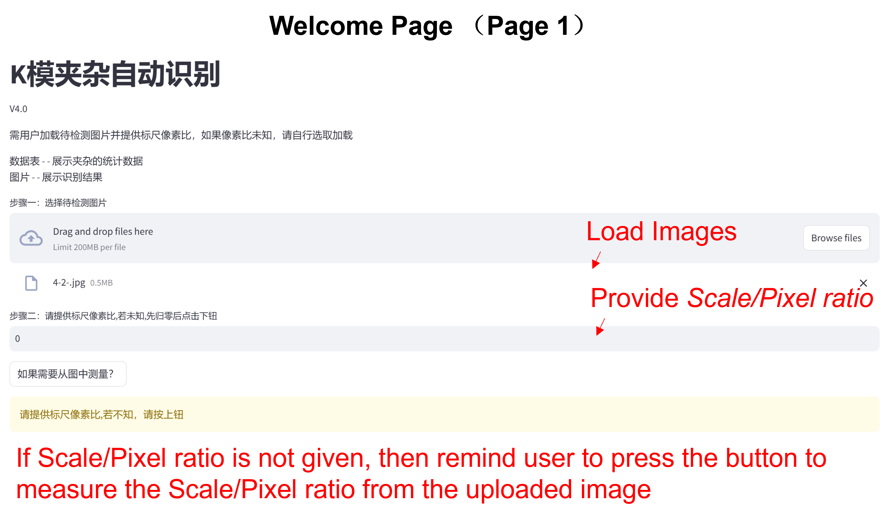
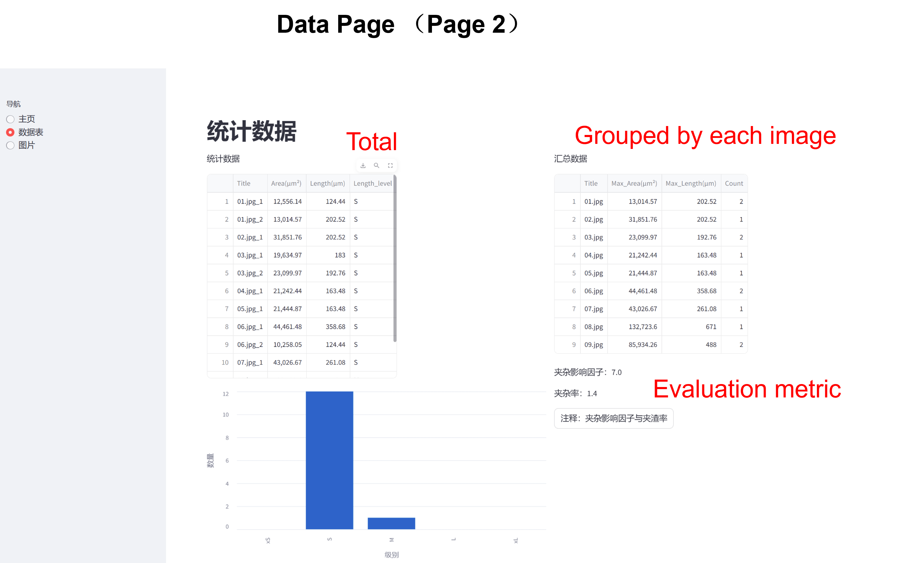
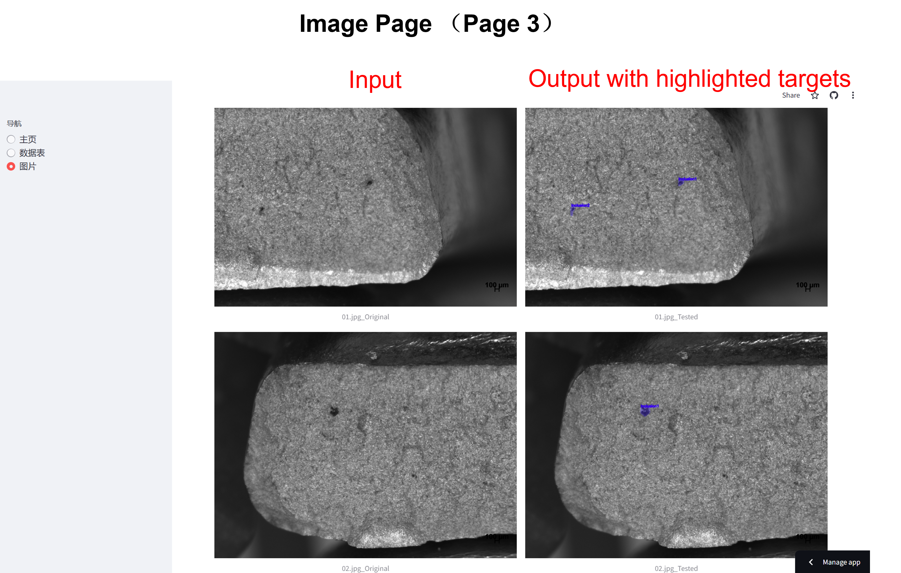

A Yolo V8 model is trarined to automatically detect inclusions/oxides in the microscopic images.

Using Streamlit for data visualization and [click here](https://pan1fan2-dk-inc-auto-home3-gwjjsi.streamlit.app/) to see how it looks.

There are 3 pages.  On the 1st page ， see below， users can load multiple images including targets of interest. 

if the scale is not known, then press the button that allows the user to measure the scale/pixel ratio from the uploaded image.

Given the scale on Page 1 ,you can check the sizes(length and area) of the targets on Page 2.

Do not forget to check Page 3, you can review the how the image segamentation performs.

